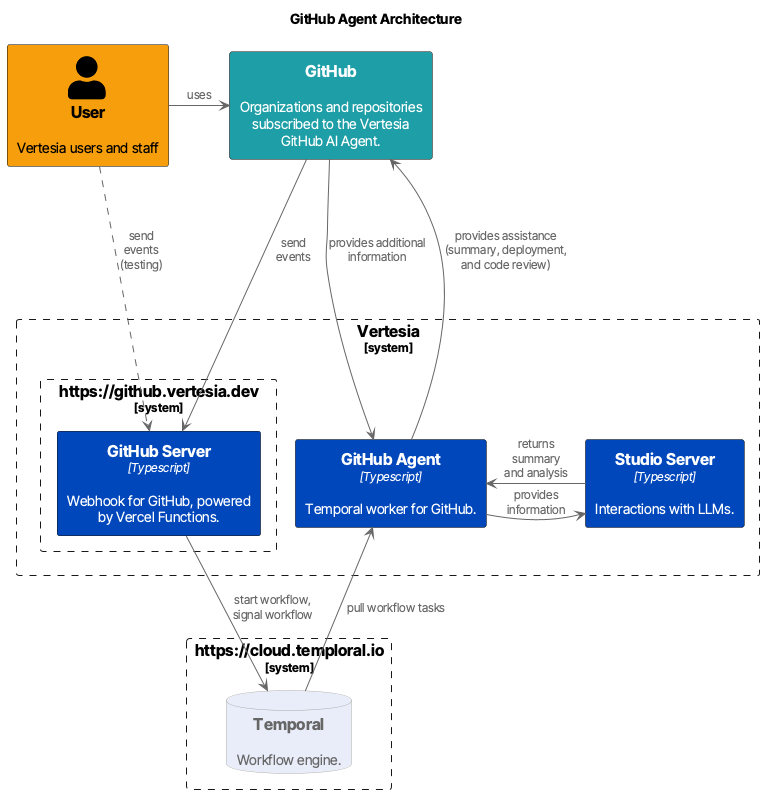

# GitHub Agent

This project demonstrates the integration of GitHub into Vertesia as a Custom Worker.



## Prerequisites

* You need to have access to Google Cloud project `dengenlabs` to fetch certificates for connecting to Temporal Cloud.
* You have already installed and configured the Google Cloud CLI `gcloud`.
* You have `temporal` CLI installed.
* (Optional) you have Docker Desktop and `docker` CLI installed.

## Quickstart

Steps:

1. Set up the application using the `.env` file
2. Connect to the Vertesia private NPM registry
3. Download Vertesia Agent Runner SDK
4. Build the pnpm workspace

Set up the application using the `.env` file:

```sh
cp apps/github-agent/.env.template apps/github-agent/.env
# TODO: you need to update settings to adapt to your environment, especially the name of the
# envionment and the name of the application
```

Connect to private NPM registry:

```sh
pnpm vertesia:connect
#
# > @dglabs/demo-github-root@1.10.0 vertesia:connect /Users/mincong/github/demo-github
# > bin/vertesia-connect.sh
#
# Connecting to Vertesia private NPM registry
# Profile "staging-experiments" already exists
# Connected to Vertesia private NPM registry
```

Download Vertesia Agent Runner SDK:

```sh
pnpm install
```

Build the pnpm workspace:

```sh
pnpm -r build
```

Log in to Google Cloud to fetch mTLS certificates from Google Secret Manager:

```sh
gcloud auth application-default login
```

Start the agent locally:

```sh
cd apps/github-agent
pnpm start
# [17:14:20.822] INFO (llm-studio/28718): Creating worker with options
#     options: {
#       "taskQueue": "agents/vertesia/github-agent/desktop-vertesia-mhuang",
#       "debugMode": true,
#       "activities": {},
#       "workflowBundle": {
#         "codePath": "/Users/mincong/github/demo-github/apps/github-agent/lib/workflows-bundle.js"
#       },
#       "connection": {
#         "nativeClient": {},
#         "referenceHolders": {}
#       },
#       "namespace": "dev.i16ci"
#     }
```

Connect to Temporal Cloud and trigger a workflow:

```sh
# /!\ IMPORTANT /!\
# follow the output of the scripts to export certificates
./bin/load-temporal-certificates.sh

# test if the certificates are loaded correctly
temporal workflow list --limit 5

# trigger a new workflow
temporal workflow start \
    -t vertesia-github-agent/desktop-mhuang \
    --type getRepos \
    -i '{"names": ["mincong-h/mincong-h.github.io", "mincong-h/learning-node"] }' \
    -w github-agent:get-repos
```

Inspect results from Temporal Cloud:


## Application

### Agent Entrypoint

In the `main.ts` file of the Agent, you need to run a Temporal Worker based on the package `@dglabs/agent-runner`. You can `run` the runner with options. Two entries are mandatory: the location of the workflow bundle and the list of activities.

* The workflow bundle is a standlone file which contains all the workflows and their underlying dependencies. You need to package the bundle yourself.
* The activities are functions are normal functions or method executions that are intended to execute a single, well-defined action (either short or long-running), such as querying a database, calling a third-party API, or transcoding a media file.

Here is the example from GitHub Agent:

```ts
// file: apps/github-agent/src/main.ts
import { run, WorkerRunOptions, resolveScriptFile } from "@dglabs/agent-runner";

const workflowBundle = await resolveScriptFile("@dglabs/github-agent/workflows-bundle", import.meta.url);
const activities = await import('./activities.js');

const options: WorkerRunOptions = {
    workflowBundle,
    activities,
};

await run(options).catch((err: any) => {
    console.error(err);
}).finally(() => {
    process.exit(0);
});
```

## Production

Build Docker image for the AI agent:

```sh
pnpm agent:build
```

> [!WARNING]
>
> When building the Docker image on your MacBook, you need to disable Rosetta on Docker Desktop due to issue <https://github.com/docker/for-mac/issues/7255> Buildx throws Illegal Instruction installing ca-certificates when building for linux/amd64 on M2.
>
> Open Docker Desktop, go to "Settings", visit "Generaral", under "Virtual Machine Options", disable option "Use Rosetta for x86_64/amd64 emulation on Apple Silicon". Apply and restart Docker Desktop.

Push the Docker image to Google Cloud:

```sh
pnpm agent:push
```

Deploy the Docker image to Vertesia Cloud:

```sh
pnpm agent:deploy
```
